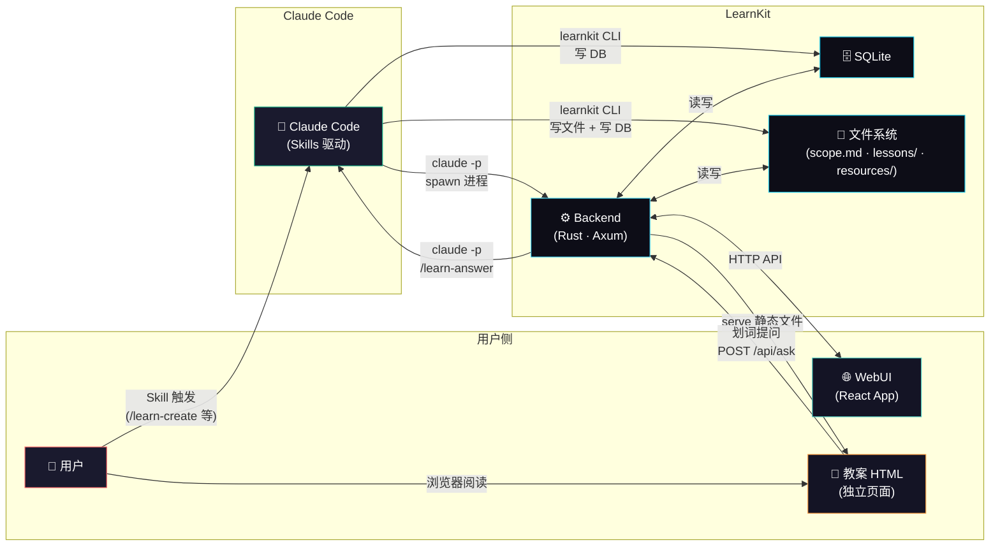
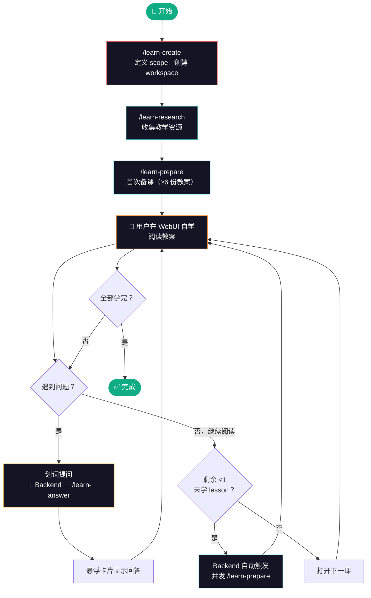
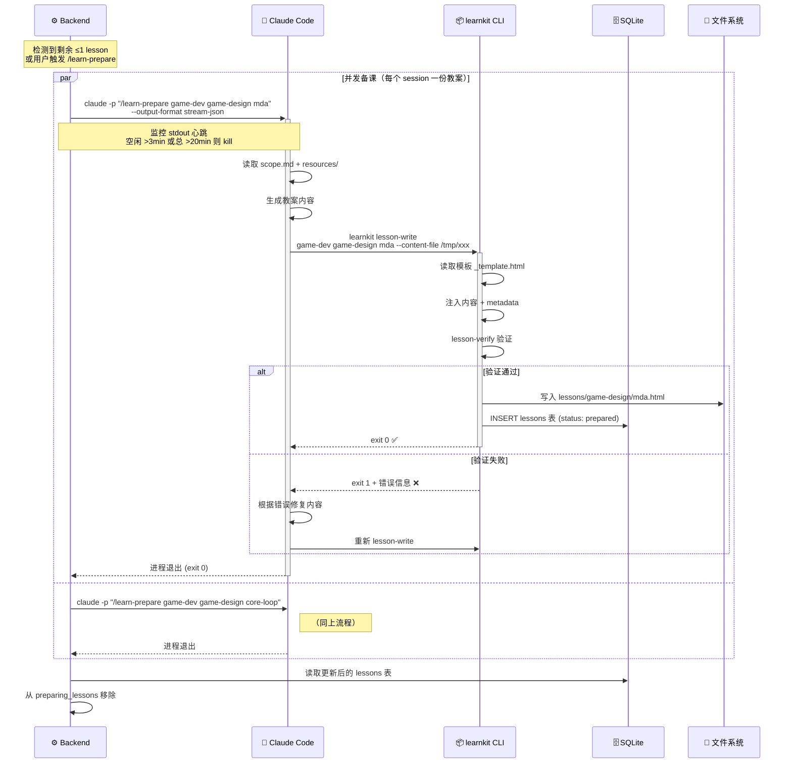
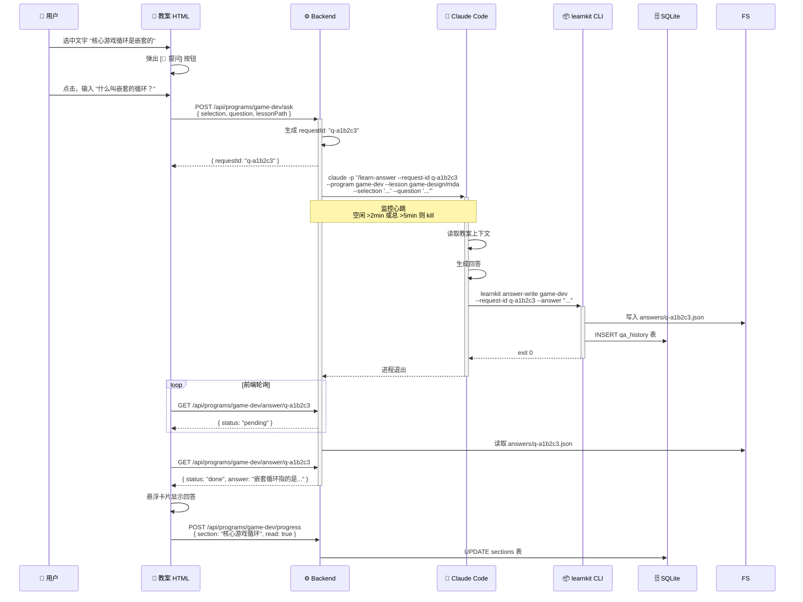

# LearnKit 设计文档

> 个人学习工具 — 将任何主题转化为结构化的交互式学习体验。

## 1. 概述

LearnKit 是一个本地学习工具，由 Claude Code Skills + Rust CLI/Backend + React WebUI 组成。用户通过 Skills 发起学习意图，Claude Code 通过 CLI 生成教案，用户在浏览器中自学，遇到问题通过划词提问获得解答。

### 核心理念

- **Claude Code 是唯一的 Agent** — 不额外调用 API，复用 Claude Code 订阅额度
- **Skills 规范行为，CLI 负责写入** — 不直接抓 Claude Code 输出
- **进程 spawn = 通信，文件系统 = 数据交换，进程退出 = 完成信号**
- **学的不是怎么写代码，而是怎么思考和决策**

### 架构总览



## 2. 术语

| 中文 | 英文 | 变量名 | 说明 |
|------|------|--------|------|
| 学习教程 | Program | `program` | 顶层实体（如"游戏开发"） |
| 科目 | Subject | `subject` | 子领域（如"游戏设计"） |
| 课程 | Lesson | `lesson` | 教学单元，对应一组教案 HTML |
| 小节 | Section | `section` | Lesson 内的章节 |
| 大纲 | Scope | `scope` | scope.md，定义 Program 结构 |
| 工作区 | Workspace | `workspace` | Program 根目录 |
| 教案 | Lesson Plan | `lesson_plan` | 生成的 HTML 教学文件 |
| 备课 | Prepare | `prepare` | 生成教案的过程 |

层级：`Program > Subject > Lesson > Section`

## 3. 学习流程



## 4. Skills 设计

### 4.1 用户 Skills（用户在 Claude Code 中手动触发）

| Skill | 说明 |
|-------|------|
| `/learn-create` | 创建学习教程，与用户讨论后生成 scope.md |
| `/learn-research` | 收集教学资源到 workspace |
| `/learn-prepare` | 手动触发备课 |

### 4.2 系统 Skills（Backend 通过 `claude -p` 自动调用）

| Skill | 触发条件 |
|-------|---------|
| `/learn-prepare` | Backend 检测到剩余 ≤1 未学完 lesson |
| `/learn-answer` | Backend 收到 WebUI 划词提问 |

### 4.3 关键 Skill 详细设计

#### `/learn-create`

1. 接收学习主题
2. 与用户对话，理解目标、基础、深度
3. 提出 subjects 划分，用户确认
4. 规划 lessons 和 sections
5. 调用 `learnkit init <program>` 创建 workspace
6. 写入 scope.md

#### `/learn-prepare`

**核心原则：每次调用只生成一份教案。** Backend 并发多个 `claude -p` session 生成多份。

1. 接收参数：program、subject、lesson
2. 读取 scope.md 获取该 lesson 的 sections
3. 读取 resources/ 中的相关教学资源
4. 生成一份教案（遵循 DESIGN.md 设计规范）
5. 调用 `learnkit lesson-write` 写入 HTML + 注册到 DB
6. 调用 `learnkit progress-update` 更新进度

#### `/learn-answer`

1. 接收 request-id、program、lesson 路径、选中文本、问题
2. 读取教案文件获取上下文
3. 生成针对性回答
4. 调用 `learnkit answer-write <program> --request-id <id> --lesson <path> --selection <s> --question <q> --answer <a>` 写入 `answers/{request-id}.json` + 追加 QA 历史到 SQLite

## 5. CLI 设计

单二进制 `learnkit`，子命令区分 CLI 和 Backend：

### 5.1 命令列表

```bash
# Server
learnkit serve [--port 3377]               # 启动 Backend + serve Frontend（全局，serve 所有 programs）

# Workspace
learnkit init <program-slug>              # 创建 workspace
learnkit list                             # 列出所有 programs
learnkit info <program>                   # program 详情

# Scope
learnkit scope-write <program> --file <path>
learnkit scope-read <program>             # JSON 输出

# 教案
learnkit lesson-write <program> <subject> <lesson> --content-file <path>
                                          # 注入模板 → 自动验证 → 通过则注册到 DB
learnkit lesson-verify <program> <subject> <lesson>
                                          # 单独验证教案完整性（lesson-write 内部已自动调用）
learnkit lesson-list <program> [--status prepared|pending|completed]
learnkit lesson-open <program> <subject> <lesson>
learnkit next <program>

# 资源
learnkit resource-add <program> <url> [--type doc|repo|pdf]
learnkit resource-list <program>

# 进度
learnkit progress <program>
learnkit progress-update <program> <subject> <lesson> --status <status>
learnkit check-prepare <program>          # 退出码: 0=OK, 1=NEED_PREPARE

# 问答
learnkit answer-write <program> --request-id <id> --lesson <path> --selection <s> --question <q> --answer <a>
learnkit qa-history <program> [--lesson <path>]
```

### 5.2 自动启动 Server

每个 CLI 命令执行前检查 Backend 是否在线：
- 尝试 `GET http://localhost:3377/api/health`
- 如果失败，自动后台启动 `learnkit serve`
- 等待 health check 通过后继续执行

## 6. Backend 设计

### 6.1 HTTP API

```
# 教案服务
GET  /                                → React App: Program 列表
GET  /program/:slug                   → React App: Lesson 列表
GET  /api/programs                    → 所有 programs (JSON)
GET  /api/programs/:slug/lessons      → 指定 program 的教案列表 (JSON)
GET  /api/programs/:slug/scope        → 指定 program 的大纲 (JSON)
GET  /lessons/:slug/{subject}/{lesson}.html → 教案页面（静态 HTML）

# 问答
POST /api/programs/:slug/ask          → 提交提问（异步）
     Body: { selection, question, lessonPath }
     Response: { requestId }
GET  /api/programs/:slug/answer/{requestId} → 轮询回答结果
     Response: { status: "pending"|"done"|"error", answer? }
GET  /api/programs/:slug/qa-history?lesson={path} → 问答历史

# 进度
GET  /api/programs/:slug/progress     → 学习进度
POST /api/programs/:slug/progress     → 上报阅读进度
     Body: { lessonPath, section, status }

# 备课
GET  /api/programs/:slug/prepare-status → 是否需要备课
POST /api/programs/:slug/prepare      → 手动触发备课

# 系统
GET  /api/health                      → 健康检查
```

### 6.2 自动备课检测

Backend 定时（每 60 秒）执行 `check-prepare` 逻辑：

```
# 以当前学习的 subject 为优先级
current_subject = 用户最近在学的 subject
prepared_but_unfinished = current_subject 中已生成但未学完的 lesson 数

if prepared_but_unfinished <= 1 AND 无正在进行的备课任务:
    获取下一批 lessons（优先当前 subject，其次下一个 subject）
    并发 spawn 多个: claude -p "/learn-prepare <program> <subject> <lesson>"
    每个 session 生成一份教案
    将这些 lessons 加入「正在备课」内存列表，防止重复触发
    session 退出后从列表移除
```

**防重复机制**：Backend 维护一个 in-memory 的 `preparing_lessons: HashSet<String>`，spawn 前检查，退出后清除。

### 6.3 进程监控与超时

Backend 通过 `--output-format stream-json` 启动 `claude -p`，逐 chunk 读取 stdout 作为心跳信号：

```
Backend spawn claude -p --output-format stream-json "/learn-prepare ..."
  ├── 逐 chunk 读取 stdout
  ├── 每收到 chunk → 重置 idle 计时器
  ├── idle 超时 → 判定卡住，kill 进程
  ├── 总超时 → 强制 kill
  └── 正常退出 → 完成
```

| 任务类型 | 空闲超时（无输出） | 总超时 | 说明 |
|---------|----------------|--------|------|
| prepare（备课） | 3 分钟 | 20 分钟 | 教案内容多但不该长时间无输出 |
| answer（回答） | 2 分钟 | 5 分钟 | 回答应快速完成 |

### 6.4 智能重试

`claude -p` 失败时：

| 失败原因 | 策略 |
|---------|------|
| 空闲超时（无输出超时） | 立即重试 1 次 |
| 总超时 | 立即重试 1 次（可能是内容特别多） |
| 非零退出码 | 读取 stderr，分析原因 |
| 额度不足（429 类错误） | 等待 5 分钟后重试 |
| 网络错误 | 等待 30 秒后重试 |
| 重试仍失败 | 记录错误日志，标记 lesson 为 `prepare_failed` |

## 7. WebUI 设计

### 7.1 两层页面架构

WebUI 分为两层，来源不同：

| 层 | 技术 | 来源 | 职责 |
|----|------|------|------|
| **应用壳** | React (Vite build) | LearnKit 自带 | Program 列表、Lesson 列表、进度展示 |
| **教案页面** | 独立 HTML | Claude Code 生成 | 学习内容、划词提问、进度上报 |

两层通过链接跳转衔接（非 iframe）：

```
React App (应用壳)                    教案 HTML (独立页面)
┌─────────────────┐                  ┌──────────────────────────┐
│ 🏠 LearnKit     │   点击 lesson    │ ← 返回列表  游戏设计概论   │
│                  │ ──────────────→ │                           │
│ 📚 游戏开发      │                  │  [教案正文]                │
│  ✅ 游戏设计概论  │                  │  [划词提问 JS]             │
│  📖 玩家心理学   │   ← 返回列表     │  [进度上报 JS]             │
│                  │ ←─────────────  │                           │
│ 📚 强化学习      │                  │  返回列表 | 上一课 | 下一课  │
└─────────────────┘                  └──────────────────────────┘
```

### 7.2 应用壳页面（React）

**Program 列表页** (`/`)
- 显示所有已创建的 programs
- 每个 program 卡片：标题、创建时间、整体进度、subjects 数量
- 点击进入 program 详情

**Program 详情页** (`/program/:slug`)
- 显示该 program 的所有 subjects 和 lessons
- 每个 lesson 显示状态标签（待备课 / 已备课 / 学习中 / 已完成）
- subject 级别进度条
- 点击 lesson → 跳转到教案 HTML 页面

### 7.3 教案页面（独立 HTML）

由 CLI `lesson-write` 命令将 Claude Code 生成的内容注入到统一模板中。

**模板内置组件**（不依赖 React）：
- **导航栏**：返回列表链接、program/subject/lesson 标题、上/下课
- **目录侧边栏**：sections 锚点
- **正文区域**：Claude Code 生成的教案内容
- **划词提问**：选中文字 → 工具栏 → 输入框 → 悬浮卡片回答
- **进度上报**：滚动阅读时标记 section 已读（调用 `POST /api/progress`）
- **主题切换**：日间/夜间模式
- **问答历史面板**：当前教案的历史问答

**划词提问交互**（纯 JS，不依赖 React）：
1. 用户选中一段文字
2. 选区上方出现 `[📝 提问]` 按钮
3. 点击弹出输入框（预填选中文本作为引用）
4. 回车提交 → `POST /api/ask` → loading 状态
5. 轮询 `GET /api/answer/{requestId}` 等待回答
6. 悬浮卡片显示回答（可关闭、可固定）
7. 自动保存到 QA 历史

**模板注入 + 验证流程**：
```
Claude Code 生成教案内容 (纯 HTML body)
  → learnkit lesson-write
    → 读取模板 (_template.html)
    → 注入内容到模板的 {{content}} 占位符
    → 注入 metadata（program、subject、lesson、上/下课链接）
    → 生成完整 HTML
    → lesson-verify 自动验证 ──┐
      ✅ 通过 → 写入文件 + 注册 DB │
      ❌ 失败 → 返回错误信息       │
               不写入、不注册     ←┘
```

**lesson-verify 检查项**（纯确定性检查，零 LLM 成本）：

| 检查项 | 说明 |
|--------|------|
| 模板骨架 | 导航栏、目录容器、正文容器、页脚导航 DOM 节点存在 |
| 划词提问 JS | `POST /api/programs/:slug/ask` 调用代码存在且 URL 正确 |
| 进度上报 JS | `POST /api/programs/:slug/progress` 调用代码存在 |
| 主题切换 | 切换按钮和 `[data-theme]` CSS 逻辑存在 |
| 导航链接 | 返回列表 href 有效、上/下课链接正确 |
| Sections 匹配 | HTML 中的 section 标题/锚点与 scope.md 中该 lesson 的 sections 一致 |
| HTML 有效性 | 关键标签闭合（html/head/body/script） |

验证失败时，CLI 返回非零退出码 + 具体失败项，`/learn-prepare` skill 可据此让 Claude Code 修复后重试。

### 7.4 路由总览

```
# React App（应用壳）
/                                → Program 列表
/program/:slug                   → Lesson 列表 + 进度

# 教案 HTML（独立页面，Backend 静态 serve）
/lessons/:subject/:lesson.html   → 教案阅读页
```

### 7.5 第二阶段（体验增强）

- 进度仪表盘（React 页面）
- 问答历史（React 页面）
- 资源浏览（React 页面）
- 设置（React 页面）

## 8. 存储设计

### 8.1 SQLite 数据库

**SQLite 是唯一的持久化存储**。每个 Program 有独立的 DB 文件，天然隔离。
不使用 progress.json 或 qa-history.json — 所有状态数据都在 SQLite 中。
`answers/` 目录仅作为 Claude Code 与 Backend 之间的临时文件交换区，Backend 读取后数据入库。

位于 `~/.learnkit/{program}/learnkit.db`（WAL 模式，支持并发读写）

**表结构**：

```sql
-- 教案索引
CREATE TABLE lessons (
    id TEXT PRIMARY KEY,           -- "game-design/mda-framework"
    subject TEXT NOT NULL,
    lesson TEXT NOT NULL,
    title TEXT NOT NULL,
    status TEXT NOT NULL DEFAULT 'pending',  -- pending/prepared/in_progress/completed
    file_path TEXT,
    prepared_at DATETIME,
    started_at DATETIME,
    completed_at DATETIME
);

-- Section 进度
CREATE TABLE sections (
    id INTEGER PRIMARY KEY AUTOINCREMENT,
    lesson_id TEXT NOT NULL REFERENCES lessons(id),
    title TEXT NOT NULL,
    read BOOLEAN NOT NULL DEFAULT 0,
    read_at DATETIME
);

-- 问答历史
CREATE TABLE qa_history (
    id TEXT PRIMARY KEY,           -- request-id
    lesson_id TEXT NOT NULL REFERENCES lessons(id),
    selection TEXT NOT NULL,
    question TEXT NOT NULL,
    answer TEXT NOT NULL,
    created_at DATETIME NOT NULL DEFAULT CURRENT_TIMESTAMP
);

-- 教学资源
CREATE TABLE resources (
    id INTEGER PRIMARY KEY AUTOINCREMENT,
    url TEXT NOT NULL,
    type TEXT NOT NULL,            -- doc/repo/pdf
    local_path TEXT,
    description TEXT,
    created_at DATETIME NOT NULL DEFAULT CURRENT_TIMESTAMP
);
```

### 8.2 Scope 文件

`~/.learnkit/{program}/scope.md` — YAML frontmatter（结构化数据，机器解析）+ Markdown（补充说明，人类阅读）

**完整示例**：
```yaml
---
program: game-dev
title: 游戏开发
created: 2026-03-22
difficulty: beginner → advanced
subjects:
  - slug: game-design
    title: 游戏设计
    lessons:
      - slug: game-design-intro
        title: 游戏设计概论
        sections:
          - 什么是游戏设计
          - MDA 框架详解
          - 核心游戏循环
      - slug: player-psychology
        title: 玩家心理学
        sections:
          - Bartle 玩家分类
          - 心流理论
          - 动机设计
  - slug: game-programming
    title: 游戏编程
    lessons:
      - slug: engine-selection
        title: 引擎选择
        sections:
          - Godot vs Unity vs Unreal
          - 独立开发者选择指南
---

# 游戏开发

本教程覆盖游戏开发全流程。

## 学习建议
- 先学游戏设计，建立全局视野
- 编程部分推荐配合 Godot 实操
```

`learnkit scope-read` 从 YAML frontmatter 解析结构化数据，输出 JSON

### 8.3 Workspace 目录结构

```
~/.learnkit/{program}/
├── scope.md                    # 大纲（YAML frontmatter + Markdown）
├── learnkit.db                 # SQLite 数据库
├── resources/                  # 教学资源
│   ├── docs/
│   ├── repos/
│   └── index.md
├── lessons/                    # 教案 HTML
│   └── {subject}/
│       └── {lesson}.html
└── answers/                    # 回答文件（临时交换区）
    └── {request-id}.json
```

## 9. 通信机制

**核心原则**：
- **下行**：Backend spawn `claude -p` 子进程
- **上行**：Claude Code 调用 `learnkit` CLI 写文件 + 写 DB
- **完成信号**：子进程退出（exit code 0 = 成功）

### 9.1 备课时序



### 9.2 划词提问时序



### 9.2 WebUI ↔ Backend

标准 HTTP REST API，Frontend 通过 fetch 调用 Backend API。

### 9.3 并发备课

Backend 并发启动多个 `claude -p` 进程，每个生成一份教案。SQLite 天然支持并发写入（WAL 模式）。

## 10. 技术栈

| 组件 | 技术 | 说明 |
|------|------|------|
| CLI + Backend | Rust + Axum + rusqlite | 单二进制，子命令区分 |
| Frontend | React + Vite + TypeScript | build 为静态文件 |
| 数据库 | SQLite (WAL mode) | 嵌入式，并发安全 |
| Scope 格式 | YAML frontmatter + Markdown | serde_yaml 解析 |
| 教案格式 | HTML（独立设计体系） | DESIGN.md 规范 |
| 教案设计 | 多套风格，lesson 内统一 | 避免视觉疲劳 |

## 11. 项目结构

```
learnkit/
├── cli/                        # Rust crate（CLI + Backend）
│   ├── Cargo.toml
│   └── src/
│       ├── main.rs             # 入口，子命令路由
│       ├── commands/           # CLI 子命令实现
│       ├── server/             # Axum HTTP server
│       ├── db/                 # SQLite 操作层
│       ├── models/             # 数据模型
│       └── utils/              # 工具函数
├── frontend/                   # React + Vite 前端
│   ├── package.json
│   ├── vite.config.ts
│   └── src/
│       ├── pages/              # 页面组件
│       ├── components/         # UI 组件
│       └── api/                # API 调用层
├── skills/                     # Claude Code Skills
│   ├── learn-create/
│   ├── learn-research/
│   ├── learn-prepare/
│   ├── learn-answer/
│   ├── learn-review/
│   ├── learn-progress/
│   └── learn-next/
├── docs/
│   ├── architecture.md         # 本文件（项目架构设计）
│   ├── terminology.md          # 术语表
│   ├── skills.md               # Skills 详细设计
│   ├── cli.md                  # CLI + Backend 详细设计
│   └── DESIGN.md               # 教案 UI/UX 设计冻结规范
├── test-mvp/                   # MVP 可行性测试
└── README.md
```

## 12. 验证结果

MVP 测试已通过三项核心假设（见 test-mvp/）：

| 测试 | 结果 |
|------|------|
| `claude -p` 能调用 bash 执行 CLI 写文件 | ✅ |
| `claude -p` 能写回答文件（answer-write） | ✅ |
| 并发 3 个 `claude -p` session 无冲突 | ✅ |
